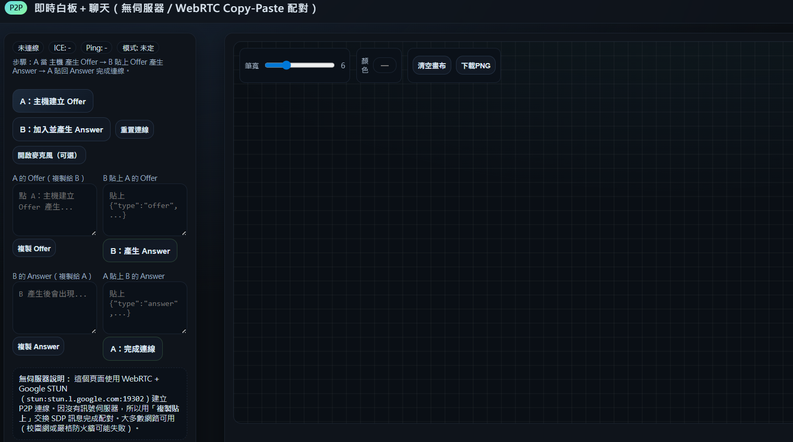

# P2P Whiteboard (No-Server)

以 WebRTC 實作、**無伺服器**啟動的即時白板＋聊天工具。支援點對點連線、筆跡同步、游標分享，主打「立即可用、免帳號、跨裝置」。

## 功能
- 🚀 純前端 P2P，免後端、免註冊
- 🖊️ 筆跡/游標/聊天即時同步
- 📱 單一 HTML，可直接打開使用
- 🔧 可擴充語音、回放、底圖上傳

## 快速開始
### 方式 A：直接開啟
1. 下載或開啟 `index.html`
2. 依頁面指示 Copy–Paste 信令，即可連線

### 方式 B：本機啟動（Node）
```bash
npm i -g serve
serve .

## Demo
- GitHub Pages：https://cccat970122.github.io/p2p-whiteboard/
- 影片 / 動圖示意：
  - 
